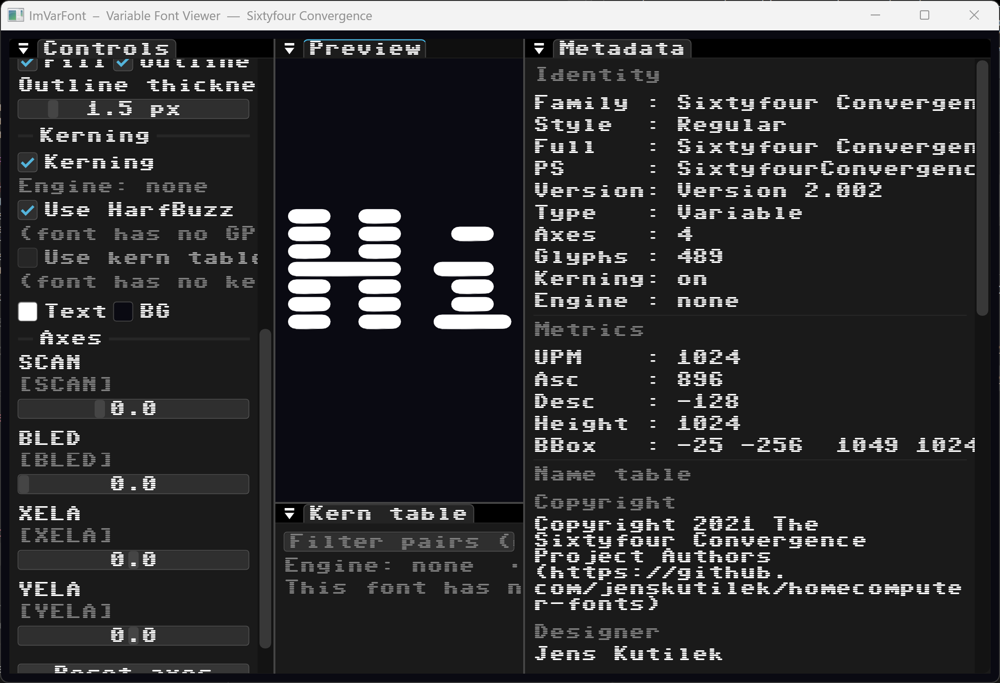

# ofxVariableFont

openFrameworks addon for **variable fonts** (and static TTF/OTF).

Load, set design axes, kern, and render as **`ofPath`** / **`drawString()`**, or filled **GPU coverage** on the OF canvas via **`drawStringGpu()`** (vendored `varfont_gl`). ImGui is an optional UI / comparison **host** — not required for GPU text.



## Architecture

```
Hosts (composite atlas quads onto a surface)
  • this addon         — ofPath, drawString, drawStringGpu
  • ImGui (optional)   — AxisSliders, AddText → ImDrawList
  • (your engine)      — BeginHostFrame + SetGlyphQuadEmitter
        │
        ▼
ImVarFont  (vendored under libs/ImVarFont/ — the library)
  Face / morph / layout   imgui_var_font.*  (core extract planned)
  GPU coverage atlas      varfont_gl.*      (ImGui-free)
```

**ofxCompositorKit** (ECS layer FBO blends / masks) is unrelated app plumbing — do not couple this addon to it.

Engine: [**ImVarFont**](https://github.com/GitBruno/ImVarFont). Academic manuscript / benches: [**VarFont**](https://github.com/GitBruno/VarFont) (`paper/` = PDF write-up, not a GPU surface).

## Features

- Variation axes with optional extrapolation
- `getGlyphPath()` / `getStringPaths()` → `ofPath`
- `drawString()` (CPU paths), `drawStringGpu()` (atlas quads on the OF canvas)
- Optional HarfBuzz GPOS; legacy kern table fallback
- GPU analytic coverage (`varfont_gl` — signed-area / exact-curve, optional morph)
- Optional `VarFontImGui.h` helpers for ImGui preview

## Examples

| Example | Description |
|---------|-------------|
| [`example/`](example/) | OF-canvas GPU specimen + docked ImGui controls (optional ImGui preview / Raster) |
| [`example-ofKitty/`](example-ofKitty/) | **ofxKit** shell: font on the main canvas with a transparent **ofxImGuiNodeEditor** modulator graph overlay |

```bash
cd addons/ofxVariableFont/example
make

cd ../example-ofKitty
make
```

## Usage

```cpp
#include "ofxVariableFont.h"
#include <GLFW/glfw3.h>

// After your GL context is current (e.g. in ofApp::setup):
ofDisableArbTex();
ImVarFont::InitRenderer(reinterpret_cast<void*(*)(const char*)>(glfwGetProcAddress));

varfont::VarFontFace face;
if (face.load("fonts/MyFont.ttf")) {
    face.applyAxes();
    // GPU fill on the OF canvas:
    face.drawStringGpu("Hello", 40.f, 80.f, 96.f, ofColor::white);
    // Or vector outlines:
    // for (const ofPath& p : face.getStringPaths("Hello", 40.f, 80.f, 96.f))
    //     p.draw();
}

// In exit():
ImVarFont::ShutdownRenderer();
```

## Layout

| Path | Role |
|------|------|
| `src/` | `VarFontFace` wrapper (`ofPath` + `drawStringGpu`) |
| `libs/ImVarFont/` | Vendored ImVarFont (`imgui_var_font.*`, `varfont_gl.*`) |

## Dependencies

- **ofxImGui** (optional helpers / examples; GPU canvas path only needs a GL context + FreeType)
- **FreeType** (via openFrameworks)
- **HarfBuzz** (optional, enabled on msys2/linux/osx via `addon_config.mk`)

No Clipper2 — filled glyphs use the GPU coverage backend in `varfont_gl`.

## License

- **ofxVariableFont** (wrappers, examples): MIT — see [LICENSE](LICENSE).
- **Bundled ImVarFont** under `libs/ImVarFont/`: its own license — see
  [libs/ImVarFont/LICENSE](libs/ImVarFont/LICENSE) (MIT; Omar WTFPL exemption).
